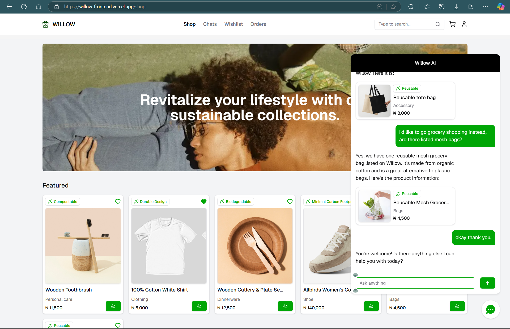

# Willow


Links:
- [Frontend](https://willow-frontend.vercel.app)
- [Backend (API documentation)](https://willow-backend.onrender.com)

## Description

Willow is an AI-powered online marketplace which hosts only *eco-friendly* products. It prioritises a **consumer-first** approach to solve goal 12 of the 17 **Sustainable development goals** - responsible production and consumption.

**Problem**:

- **Recycling Challenges:** Only about 10% of plastic waste is properly recycled.
- **Long Degradation Period:** Plastic takes between 500 to 1000 years to degrade, and even then it breaks down into microplastics rather than fully disappearing.
- **Waste Management Crisis:** The issue isn't just the volume of plastic produced, but also how much of it is mismanaged. For example, countries like Nigeria have an alarmingly high rate of mismanaged waste [87.5%](https://plasticbank.com/blog/plastic-pollution-by-country/)

**Solution**: Reduce plastic consumption by encouraging sustainable shopping habits.

---

## Table of Contents

- [Willow](#willow)
  - [Description](#description)
  - [Table of Contents](#table-of-contents)
  - [Features](#features)
  - [Tech Stack](#tech-stack)
  - [Installation](#installation)
  - [Key Implementations](#key-implementations)
    - [Recommendation system](#recommendation-system)
      - [Core Features](#core-features)
      - [Technical Implementation](#technical-implementation)
      - [Recommendation Generation Process](#recommendation-generation-process)
      - [Scheduled Updates Architecture](#scheduled-updates-architecture)
      - [Product Embedding Generation](#product-embedding-generation)
    - [AI-Assisted Vetting](#ai-assisted-vetting)
      - [Architecture Overview](#architecture-overview)
      - [Technical Implementation](#technical-implementation-1)
      - [Evaluation Protocol](#evaluation-protocol)
      - [Special Evaluation Cases](#special-evaluation-cases)
      - [Output Format](#output-format)
    - [RAG-Based Customer Chat System](#rag-based-customer-chat-system)
      - [System Architecture](#system-architecture)
      - [Technical Implementation](#technical-implementation-2)
      - [Implementation Details](#implementation-details)
  - [Future Implementations](#future-implementations)
  - [Contributing](#contributing)
  - [License](#license)
  - [Contact](#contact)
  - [Troubleshooting](#troubleshooting)
    - [⚠️ `.env` Misconfiguration](#️-env-misconfiguration)
    - [⚠️ Database Connection Fails](#️-database-connection-fails)

---

## Features

- **Recommendation System:**
  - Assigns weights to different customer interactions.
  - Uses a decay formula to account for diminishing interest over time.
  - Embeds each product using Gemini's text embedding model 004.
  - Computes a weighted average of user interactions.
  - Recommends the top 5 products based on minimal Euclidean distance.
- **Semantic Search:** Utilizes vector similarity for an enhanced search bar experience.
- **RAG System for Chatbot:**
  - Willow's chatbot uses a Retrieval-Augmented Generation system.
  - Capable of recommending products from the catalog.
- **AI-Assisted Product Vetting:** Uses AI to evaluate uploaded products before listing.
- **Payment Integration:** Seamlessly integrated with Paystack.
- **JWT Authentication:** Secure user login with JWT tokens.
  - Access and Refresh Tokens: Implements both token types with management of refresh token reuse.
- **File Uploads:** Managed using MulterS3 for efficient file handling.
- **Email Verification via OTP:** Ensures user authenticity through one-time passwords.
- **Route-Based Rate Limiting:** Applies rate limits based on the criticality of each route.
- **Modular Code Structure:** Simplifies maintenance and scalability.
- **Swagger Documentation:** All routes are documented using Swagger.
- **Central Error Handler:** A unified function to manage errors across the API.

---

## Tech Stack

- **Node.js & Express**: Primary framework and runtime for our API.
- **Render**: Hosting platform for deploying the backend.
- **Neon & PostgreSQL**: Cloud-hosted relational database for data storage.
- **Prisma**: ORM for efficient database interactions.
- **Multer-S3**: Handles file uploads directly to AWS S3.
- **Swagger**: Auto-generates API documentation.
- **JWT**: Implements authentication with both access and refresh tokens.
- **Google Generative AI**: Integrates Gemini 1.5 Flash and Cloud Vision for AI-powered features.
- All package versions and additional tools are specified in the `package.json` file.

---

## Installation

1. **Clone the Repository:**

   ```bash
   git clone https://github.com/yourusername/your-repo-name.git
   cd your-repo-name
   ```

2. **Install Dependencies:**

    ```bash
    npm install
    ```

3. **Set Up Environment Variables:**

    ```bash
    cp .env.example .env
    ```

    Configure the necessary values for PostgreSQL, Neon, Render, Google Generative AI, and other services.

4. **Start the Server:**

    ```bash
    npm run start:main
    ```

---

## Key Implementations

### Recommendation system

The recommendation engine implements a hybrid approach combining collaborative filtering and content-based recommendations using product embeddings. This system dynamically adapts to user interactions and provides personalized product suggestions.

#### Core Features

- **Time-Decay Weighted Interactions**: User interactions (likes, views, reviews, purchases) are weighted by recency using exponential decay functions
- **Vector Embeddings**: Products are represented as dense vector embeddings using Google's Generative AI text-embedding-004 model
- **Similarity Matching**: Recommendations are generated by finding products with embeddings most similar to the user's preference vector
- **Scheduled Updates**: Recommendations refresh automatically every 5 minutes for active users
- **Cold Start Handling**: New users with no interaction history receive randomized recommendations from approved products

#### Technical Implementation

The recommendation system processes four primary interaction types (likes, views, reviews, purchases), each with a custom decay rate to prioritize recent activity:

| Interaction Type | Decay Rate | Half-Life (Days) |
|------------------|------------|------------------|
| Likes            | 0.005      | 138.6           |
| Views            | 0.02       | 34.7            |
| Reviews          | 0.002      | 346.6           |
| Purchases        | 0.01       | 69.3            |

Each interaction's weight decays exponentially over time according to:

$w(t) = w_0 \cdot e^{-\lambda \cdot \frac{t}{86400}}$

Where:
- $w(t)$ is the decayed weight at time $t$ (in seconds since the interaction)
- $w_0$ is the initial weight of the interaction
- $\lambda$ is the decay rate constant specific to the interaction type
- $t$ is the time elapsed since the interaction occurred
- The division by 86400 converts seconds to days

#### Recommendation Generation Process

1. **User Profile Creation**: For users with interaction history, the system retrieves all product embeddings associated with their interactions
2. **Weighted Vector Calculation**: A weighted vector sum is computed by:
   
   $\vec{v}_{weighted} = \frac{\sum_{i=1}^{n} w_i \cdot \vec{v}_i}{\sum_{i=1}^{n} w_i}$
   
   Where:
   - $\vec{v}_i$ is the embedding vector of the i-th product
   - $w_i$ is the time-decayed weight of the i-th interaction
   - $n$ is the total number of interactions

3. **Normalization**: The weighted sum is normalized to create a unit vector:
   
   $\vec{v}_{normalized} = \frac{\vec{v}_{weighted}}{||\vec{v}_{weighted}||}$

4. **Similarity Matching**: The system finds products with the closest embedding vectors using cosine similarity i.e *1 - (user profile embedding <=> other_products embeddings)* (implemented via PostgreSQL's vector operators)

5. **Database Update**: The top 5 most similar products are stored in the recommendations table for fast retrieval

#### Scheduled Updates Architecture

**(Unoptimized)**
The system uses a **node-cron** based job scheduler that:

- Creates individual cron jobs for each active user
- Runs every 5 minutes to refresh recommendations
- Automatically terminates jobs for inactive users
- Maintains a registry of all scheduled jobs for efficient management

#### Product Embedding Generation

Products are embedded at upload time using Google's Generative AI. The embedding process:

1. Formats product data into a standardized text representation
2. Generates a dense vector embedding using the text-embedding-004 model
3. Stores the embedding in the product table for efficient similarity computations

This recommendation system balances computational efficiency with personalization quality, providing relevant product suggestions while maintaining reasonable resource usage.

### AI-Assisted Vetting

The platform implements an AI-assisted sustainability evaluation system that automates the vetting process for product listings. This system ensures that all products meet Willow's eco-conscious marketplace standards through algorithmic assessment.

#### Architecture Overview

- **Multi-Source Analysis**: Combines seller-provided product data with Google Cloud Vision AI analysis
- **Objective Assessment**: Evaluates sustainability claims against visual evidence and product metadata
- **Standardized Scoring**: Implements a consistent 0-100 scoring system with clear thresholds
- **Real-Time Feedback**: Provides immediate sustainability assessments during the product submission flow

#### Technical Implementation

The vetting system operates through a sophisticated pipeline:

1. **Data Collection**: 
   - Product metadata (name, description, category, pricing, etc.)
   - Seller-provided sustainability features and claims
   - Production location and packaging information
   - End-of-life considerations

2. **Image Analysis with Google Cloud Vision**:
   - Text detection from product images
   - Dominant color extraction
   - Object and material recognition
   - Label generation for product components

3. **Comprehensive Data Processing**:
   - Extracts and summarizes Cloud Vision results i.e transforms raw API responses into structured image summaries

4. **AI-Powered Evaluation**:
   - Leverages Google's Gemini 1.5 Flash model for assessment
   - Validates consistency between text descriptions and visual evidence
   - Generates detailed sustainability assessments with numerical scores

#### Evaluation Protocol

The system implements a rigorous evaluation framework:

| Score Range | Classification | Criteria |
|-------------|----------------|----------|
| 90-100 | Great | Exceptional sustainability, fully verifiable |
| 70-89 | Good | Strong efforts with minor limitations |
| 50-69 | It's a Start | Moderate features with notable trade-offs |
| 30-49 | We Avoid | Minimal sustainability benefits |
| 1-29 | Not Good Enough | Negligible or harmful sustainability efforts |
| 0.5 | Mismatch | Contradictory information detected |
| 0 | Inconclusive | Insufficient evidence to verify claims |

#### Special Evaluation Cases

- **Data Mismatch Detection**: The system compares seller descriptions with visual evidence to identify inconsistencies
- **Brand Recognition**: Incorporates publicly available sustainability data for recognized brands
- **Data Limitations Handling**: Implements handling for cases with insufficient verification data

#### Output Format

Each product assessment provides:

1. **Sustainability Score**: Quantitative assessment on the 0-100 scale
2. **Sustainability Tag**: Categorical classification of the product's strongest sustainable feature that the **seller** selected
3. **Explanation**: Concise summary highlighting positives, trade-offs, and limitations

### RAG-Based Customer Chat System

The platform implements a Retrieval-Augmented Generation (RAG) system that powers a context-aware customer chat interface. This AI-driven chat system combines semantic search with large language model capabilities to deliver personalized product recommendations and assistance.

#### System Architecture

- **Vector-Based Retrieval**: Utilizes embedding vectors for semantic similarity search
- **Multi-Context Integration**: Combines user query, browsing history, and product data
- **Real-Time Response Generation**: Dynamically generates contextually relevant responses
- **Product-Aware Conversations**: Seamlessly integrates product details into natural dialogue

#### Technical Implementation

The RAG system operates through several interconnected components:

1. **Query Embedding**:
   - User queries are transformed into vector embeddings using Google's text-embedding-004 model
   - These embeddings capture the semantic meaning of user questions beyond simple keyword matching

2. **Context Collection**:
   - **Recent User Activity**: Retrieves the user's recently viewed products
   - **Chat History**: Incorporates previous conversation context
   - **Product Database**: Queries the product database for relevant items using embeddings

3. **Vector Similarity Search**:
   - Executes a PostgreSQL vector similarity search using the `<=>` operator
   - Retrieves products with embedding similarity scores above 0.5
   - Ranks results by similarity and limits to top matches

4. **Prompt Engineering**:
   - Constructs a context-rich prompt containing:
     - System instructions defining the assistant's role and behavior
     - User's browsing history for personalization
     - Retrieved product data from the similarity search
     - Previous conversation history for continuity
     - The current user query

5. **Response Generation**:
   - Processes the assembled prompt through Google's Gemini 1.5 Flash model
   - Generates contextually relevant responses with product recommendations
   - Returns structured JSON responses containing:
     - Natural language text response
     - Product recommendations with complete metadata

#### Implementation Details

The system enforces response consistency through a structured JSON output format for the **frontend**:

```json
{
  "text": "Natural language response to user query",
  "products": [Array of relevant product objects]
}
```

This structure allows the frontend to:

1. Display conversational responses
2. Render rich product cards within the chat interface
3. Support mixed content (text interspersed with product recommendations)
4. Enable direct purchasing from the chat interface

---

## Future Implementations
1. Custom sustainability AI model
2. Expanded payment integration
3. Community-driven features for flagging misinformation and much more by experts

---


## Contributing

Contributions are welcome and encouraged. If you have ideas to improve the project, fix bugs, or add new features, feel free to open an issue or submit a pull request. All contributions should align with the project's architecture, maintainability goals, and coding standards.

Before contributing, please:

- Review the existing issues to avoid duplication.
- Keep pull requests focused and well-documented.
- Ensure your changes are tested and do not break existing functionality.

Your collaboration is deeply appreciated and will be acknowledged in the project's contributors section.

---

## License

<!-- This project is licensed under the **Attribution License (CC BY 4.0)**.

You are free to:

- **Share** — copy and redistribute the material in any medium or format  
- **Adapt** — remix, transform, and build upon the material for any purpose, even commercially

Under the following terms:

- **Attribution** — You must give appropriate credit, provide a link to the license, and indicate if changes were made. You may do so in any reasonable manner, but not in any way that suggests the licensor endorses you or your use.

[Read the full license here →](https://creativecommons.org/licenses/by/4.0/) -->

---

## Contact

For questions, feedback, or partnership inquiries, feel free to reach out:

- 📧 Email: [findtamilore@gmail.com](mailto:findtamilore@gmail.com)
- 💼 LinkedIn: [Tami CP0](https://www.linkedin.com/in/tami-cp0)

---

## Troubleshooting

Here are some common issues and how to resolve them:

### ⚠️ `.env` Misconfiguration
**Issue**: The application fails to connect to the database or external services.  
**Solution**: Ensure all required environment variables are correctly set. Use `.env.example` as a reference.

### ⚠️ Database Connection Fails
**Issue**: Server throws an error related to Prisma or Neon.  
**Solution**: Verify that your Neon/PostgreSQL database URL is correct and accessible. Run `npx prisma generate` and `npx prisma migrate deploy` if necessary.
